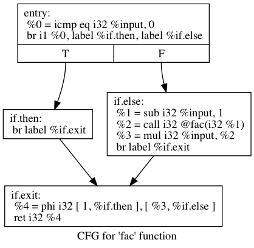
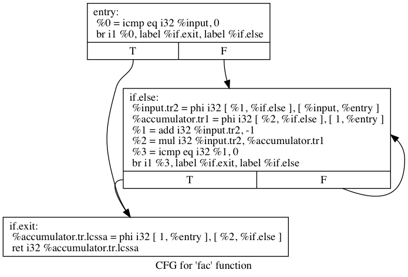
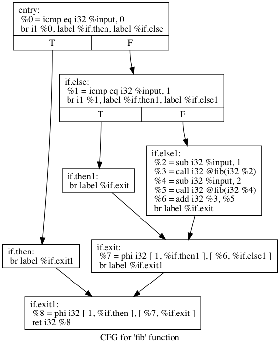
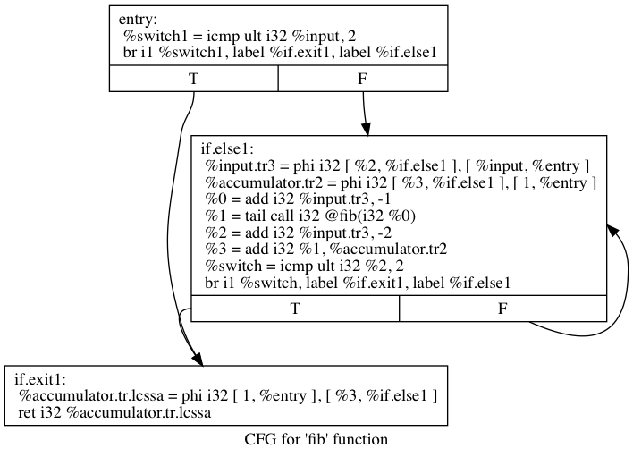

# Codecation

Repo with experiments from the 2019 codecation organized by [kabisa](https://kabisa.nl).

The repo contains a code generator written in Haskell, that can convert
an abstract syntax tree (AST) defined in Haskell to LLVM instructions.
The generated code can then be compiled/linked together with other files
in a separate step to create an executable.


## Project setup

TLDR: Nix-based project; the Makefile contains the most commonly used commands.


Long version:

The project makes use of [nix](https://nixos.org/nix/download.html) to setup the development environment.
The environment can be entered by doing the following command:

```bash
$ nix-shell
```

After this command, you can build the project:

```bash
$ make configure  # configures the project
$ make build      # builds the haskell code
$ make output     # runs the code generator and creates output files in output/folder
```


## Results

After the LLVM IR code is generated, you can use the LLVM toolchain to compile it together with other files.
It's also possible to generate the control flow graph for example:

### Factorial 




### Fibonacci 



